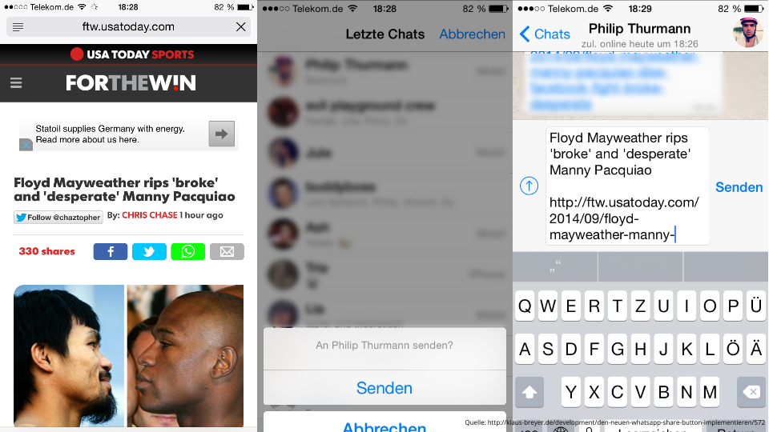

Recently, WhatsApp added a share button (I wrote this article in 2014). Buzzfeed has been testing it since the beginning but recently removed it. The button offers the convenient option of sharing an article via WhatsApp. Of course, this interested me a lot, and I took a closer look at the button. :)

## How does it work?

Behind the WhatsApp-Button is a simple link, which creates a so-called native deep link directly into the WhatsApp app and thus passes a text to the app.  And this is how it works:

```html
<a href="whatsapp://send?text=text by native deep link!">Send</a>
```


  <a href="whatsapp://send?text=Text durch native Deeplink">
    Are you mobile on the site? Then you can test the code right here.
  </a>


Like a mailto: link, anyone can include this link on their website.

## What does it look like?

After clicking on the link, WhatsApp opens with the content passed behind ?text. It looks like this:



## What to pay attention to?

Meanwhile, the button works for iOS, Android, and Windows Mobile. On the Mac OS operating system, the desktop WhatsApp app opens.

During implementation, you must ensure that the used buttons are only copied from other Websites if the copyright is clarified.

## What happens if WhatsApp is not installed?

The user is taken to the app store if WhatsApp is not installed. He can then install WhatsApp there. However, the conversion for the click is then virtually finished. The user must first register for WhatsApp and find his friends, or at least login and reactivate an old account.

This can be intercepted to prevent false expectations by asking the user again before clicking the button: Do you have WhatsApp installed?

## Conclusion

A straightforward as well as effective tool. Unlike the Facebook button, it doesn't even require Javascript or the like but instead uses the native functions of the operating system. Therefore, the possibility is very lightweight and fits perfectly with a simple mobile app like WhatsApp.

## By the way

- [At AllFacebook.de, you have to pay attention to a more detailed article from me.][1]
- [According to Recode, this button was clicked more often on BuzzFeed than on Twitter][2].
- [And Marcel Weiss from Neunetz even sees a danger for Facebook because of it!][3]
- [The legal admissibility of the WhatsApp sharing button][4]

[1]: http://allfacebook.de/features/was-der-whatsapp-share-button-kann-und-worauf-geachtet-werden-muss
[2]: https://recode.net/2014/02/20/before-facebook-deal-whatsapp-was-helping-buzzfeed-and-shazam-go-viral-with-new-platform-tools/
[3]: http://www.neunetz.com/2014/02/20/buzzfeed-sieht-mehr-aktivitat-bei-whatsapps-share-button-fur-apps-als-beim-twitter-button/
[4]: http://www.it-recht-kanzlei.de/whatsapp-sharing-button-direktmarketing.html
