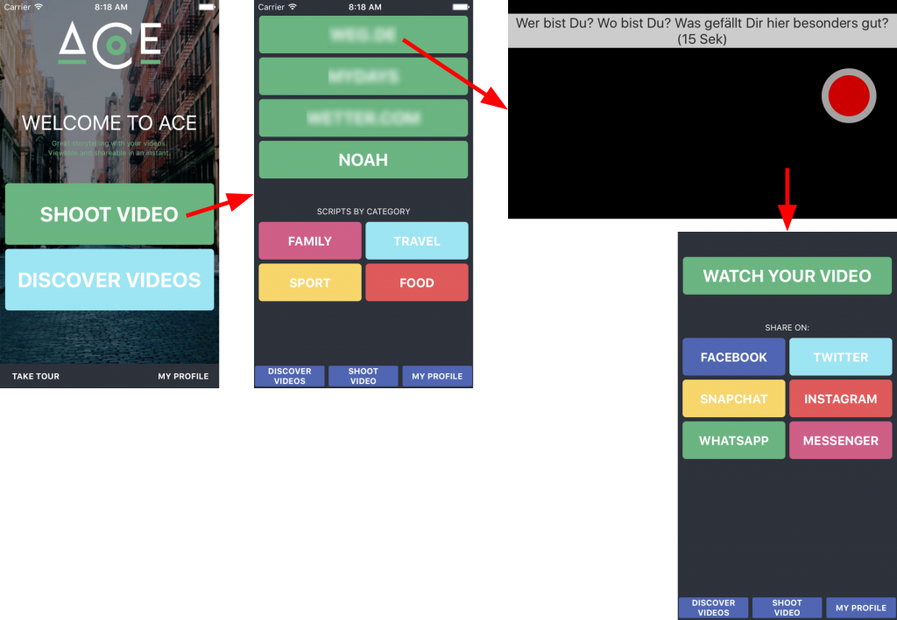
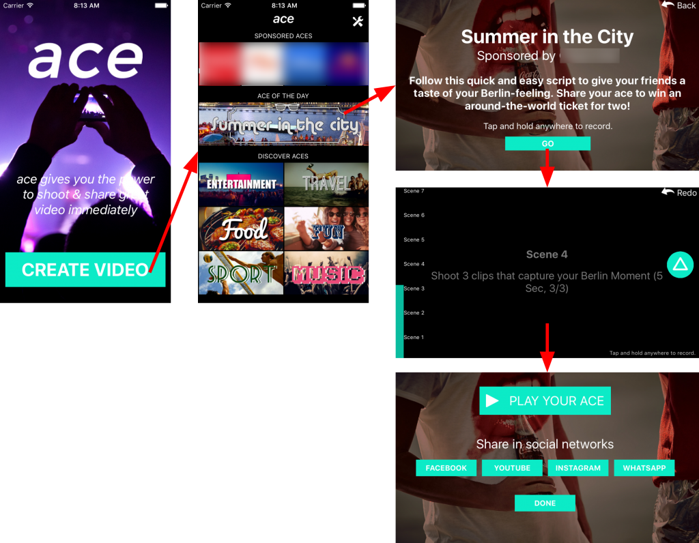

Last year, the guys from the newly founded startup [Native Studios](http://www.native-studios.com/) approached me with an app idea, which is now called [creAce](http://creace.io/) and was implemented in a prototypical process. I would like to introduce this process today.

## Idea

The basic idea behind it is that users receive support to produce high-quality video content by seeing director's instructions while recording and the own ones are subsequently combined with professionally produced transitions and content of a production company.

By now the app is live in both an [Android](https://play.google.com/store/apps/details?id=com.nativestudios&hl=de) and an [iOS](https://itunes.apple.com/de/app/creace-video-app/id1134621325?mt=8) version.

The results will surprise you - give it a try! Currently, there is also a promo for the new [NERVE Film](http://nerve-film.de/creace_challenges/), where users produce and publish videos using the creAce app.

A good overview [of the product is available on the blog of Schröder Schömbs](http://www.schroederschoembs.com/newsroom/creace/). Today I mainly want to talk about the process.

## Process: First of all 1 prototype.

We started with a very small prototype, which took only 3 man-days. This prototype could "record" a single template with director's instructions and play the recorded videos together with professional content in succession. There was no menu navigation yet, it was just the core of the value creation.

Challenges: First decisions on the basic structure were made quite pragmatically. Among other things, Touch to Record has proven itself and was kept until the release.
The prototype contributed most to the fact that the founding team also talked about things that they had not had on their radar before. The most obvious point was the question of the large upload and download volumes that such a video app brings with it - both technically and because of the user interface.

### Prototype gets menu navigation and several templates

In the next prototype, there was a basic menu navigation and two functioning templates.

At this step, we talked a lot about the challenges of generatively creating videos. The cutting of professional video content is difficult to press into a template, since the cutter makes a lot of decisions intuitively and by feeling. The cutter does this especially at transitions (for example, the background music goes up and down slightly offset at cuts). In addition, with User Generated Content, it cannot always be assumed that the content always has the same length.
The result was a separate template notation and a firmly defined feature set for the film creatives, which a rendering service can process programmatically.

Challenges: Finding a balance of abstraction that still allows a great result but can also be automated by a rendering service.
We are moving in the area of partial automation of video rendering. We don't have an individual performance here like in a professional Avid-like editing program, where a cutter makes a unique piece every time and can and wants to manually adjust everything. But we are also not moving in the area of full automation, where we end up programming an app only for a single template with changing user content. It must be configurable and reusable.

### Prototype with release-close user experience

With the whole team and UX experts, we brainstormed what features the final app needs. The features were then divided into release-critical and a later roadmap.

With the release-critical feature set and the previous learnings from use, the prototype was extended by a release-close interface and delivered to about 200 external testers. Valuable feedback!

Challenges: A normal app you want to use in portrait mode, but what about recorded videos? You probably want to have those in landscape format. How do we keep the user hooked while the video is being uploaded and processed in the background? Do we have to provide something for users who currently do not have W-Lan?

You can find the answers to this in the release version yourself. ;)

### Going live

In the meantime, the startup had signed the first customer and thus finally also a launch date. In 10 weeks, the app was then brought out of its prototyping stage to release for Android and iOS including API and complete rendering pipeline by a 5-strong developer team distributed in Berlin and Frankfurt.

In addition, a lot of work was already being done in the background on the creative side on the creation of templates and professional content.

## Technology

Even the first prototype was implemented in React Native (then v0.13).
The API relies on PHP/MySQL and the frameworks [Laravel](https://www.laravel.com/) and [Dingo](https://github.com/dingo/api).
Describing the rendering would be a completely separate topic, but basically it relies on the [Amazon Simple Workflow Service](https://aws.amazon.com/de/swf/) and the [MLT Framework](https://www.mltframework.org/) - scripted by Node.JS.

I accompanied the startup initially by creating the prototypes and during the development phase as a consultant, Dev-Ops/Infrastructure and code reviews.
