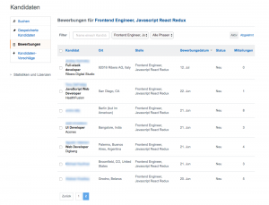

The overwhelming feedback on my last article [Global Developer Sourcing: Reasons and Process](https://klaus-breyer.de/blog/software-engineering/weltweites-entwickler-sourcing-gruende-dafuer-und-der-prozess/1692) brought one question to the fore: How do I generate worldwide applications?

## Background

The first way always leads into one's own network. When that is exhausted, there are basically two alternatives: headhunters / recruiters and job advertisements.

Headhunters, in my opinion, are particularly suitable when you want to poach a candidate from the competition without getting your hands dirty, and recruiters mainly when the person responsible has little technical knowledge, because, for example, the recruiting is done centrally by HR.

However, I have technical knowledge. And very specific requirements. In the startup environment, a developer cannot simply be onboarded for 2 months, but should ideally already have experience with exactly the framework being used. In addition, I appreciate personal contact and the first impression. On the one hand, I want to form my own opinion - on the other hand, it is more authentic for the person addressed if they deal directly with their future supervisor.

All I need for this is a sufficient number of applications. Therefore, my choice regularly also falls on job advertisements. Today, I wanted to introduce an alternative that is not yet so well known in Germany: Job advertisements on Stack Overflow.

## Stack Overflow

With some marketing background, it's of course obvious: You have to pick up the target group where they are. And where are developers? Right: On Stack Overflow. All day long. And often when they are frustrated with their current job because they have to solve a problem they might not have without the job.

So I decided to [post job advertisements on Stack Overflow](http://business.stackoverflow.com/careers/de/). The job had very specific requirements: It had to be exactly a combination of two specific frameworks (React + Redux). [This is what it looked like in my case.](https://klaus-breyer.de/wp-content/uploads/2016/08/stackoverflow-stellenanzeige.png)

In the first 24 hours, I received 25 applications for this specific position. Almost 50 in the first week. This allowed me to filter well internally and then have good conversations. You can see the result above. 

Next, I would like to go into the features.

### Targeting

The targeting can be defined very granularly for frameworks or technologies.

### Statistics

You can see not only how many applications came when, but also where the traffic to them came from.

### Applicant Management

Incoming applications and the conversation history can also be handled directly here. Unfortunately, there are also many who do not apply via the platform but directly via e-mail. Of course, they fall through the cracks here.

## Costs in Comparison

In my case, the cost for a 90-day job advertisement was 1650€. The ad can be changed or updated at any time.

Compared to traditional simple job portals (e.g. [Monster](http://www.monster.de/)), the costs are of course about 3x as high. However, if you get any applications there at all, they are usually "off-the-shelf" applications. This means: mainly university graduates and classic corporate careers who have seen nothing else but Java in their lives and not even that at production scale - no offense - or classic linear high workers who are not suitable for my startup environment and still ask for too much money.

However, the costs are still significantly lower than those of recruiters (e.g. [devbuddies.io](https://devbuddies.io)) and recruitment platforms (e.g. [4scotty](https://4scotty.com/)). They always want 10% - 30% of the candidate's annual salary. For an engineer, this can easily amount to a five-figure sum. Stack Overflow ads are still cheaper.

## Alternatives for Job Postings

At this point, I must also clearly advise against two well-known alternatives with costs in the lower three-digit range. I have wasted money and (more importantly) time trying them out.

[t3n Jobs](http://t3n.de/jobs/) I set up for two companies (10 - 50 employees) and got almost no feedback. It may be better suited for marketing trades, definitely not for developers. No application for 300€ - 450€.

[Dice](http://de.dice.com): This job portal, despite its currently aggressive advertising, has not proven itself in practice. 2 applications for 500€

One must also say that as a small company / unknown startup, one has a disadvantage with the large job portals in Germany. Most applications probably go rather to the large, established players with more prestige. You only have a chance on Stack Overflow if you formulate your job posting clearly and a little provocatively.

## Conclusion

The more specific the requirements are, the broader one should search. And that's exactly when Stack Overflow becomes interesting because of the pure range. This way, you can also generate many international applications.
