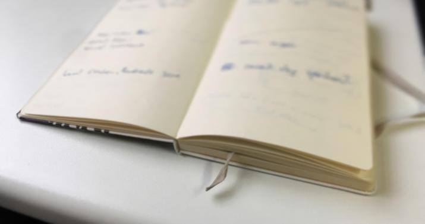

Grundsätzlich geht es für mich in einem Bewerbungsgespräch immer darum, den Bewerber zum Sprechen zu bringen. Nur so kann ein klarer Eindruck entstehen, ob man während des Gesprächs Energie beim Interviewten spürt oder ob man selbst viel Energie in das Gespräch hineinstecken musste (wenn es sehr schleppend läuft).

So kann dann schon mal ein erstes Bauchgefühl entstehen. Wenn dann das Bauchgefühl mit der fachlichen Eignung übereinstimmt, ist das für mich schon die halbe Miete. Die andere Hälfte ergibt sich dann durch das Team, mit dem der Bewerber zusammenarbeiten soll.

Startup-Unternehmer (ich auch in der Vergangenheit) machen bei ihren ersten Bewerbungsgesprächen oft den Fehler, dass sie zu viel über sich selbst oder das Unternehmen erzählen, bzw. manchmal sogar das Gefühl haben, das Unternehmen pitchen zu müssen. Das bringt den Gegenüber dann in eine Situation wo er nur noch fleissig nickt - einen guten Eindruck des Bewerbers gibt es so aber nicht.

Um das Gespräch am Laufen zu halten und mir ein fachliches Bild des Gegenübers zu machen, habe ich immer eine Liste mit Fragen vorbereitet.
Beispiel Frontend-Engineer
Im folgenden eine Liste aus dem letzten Jahr, mit der ich 9 internationale Kandidaten für eine vakante Frontend Engineer interviewte.

- Welche Projekte hast du mit react / redux bisher gemacht?
- Erzähle uns von deinem letzten Projekt mit redux forms
- Welche Erfahrungen hast du mit ES6 / ES2015.
- Hast du dabei in Teams gearbeitet? Wie groß waren die teams? Welche Rolle hattest du?
- Wie ist dein optimaler Git Workflow?
- Wie stehst du zu Immutable Data Structures? Gibt es aus deiner Sicht Projekte, wo sie sich nicht eignen?
- Wie debuggst du?
- Wie gut sind deine Design Skills?
- Wie ist dein favorisiertes Frontend Tooling? (Danach: Wir nutzen gulp, webpack, etc.)
- SCSS, SASS oder LESS?
- Mit welchen Tools extrahierst und bearbeitest du SVGs?
- CSS Animations?
- Was sind deine Top Quellen um dich über JavaScript zu informieren?
- Auf welche Events gehst du regelmäßig / noch dieses Jahr?
- Über den Tellerrand hinaus: Was ist die spannendste Technologie/Framework, die/das dich in letzter Zeit begeistern konnte.
- Welche Trends siehst du im Frontend Engineering in Zukunft?
- Wenn für deinen Lebensunterhalt gesorgt wäre, mit was bzw. mit welchem Projekt würdest du dich beschäftigen?

Ich glaube, das Prinzip wird klar: Ich stelle dabei keine Ja/Nein Fragen um eine Checkliste abzuarbeiten, sondern möchte immer, dass der gegenüber möglichst viel erzählt.

Zum Abschluss oder um es aufzulockern frage ich auch immer noch gern, ob der Bewerbende Tabs oder Spaces verwendet, bzw. nach dem favorisierten Editor und Betriebssystem.
