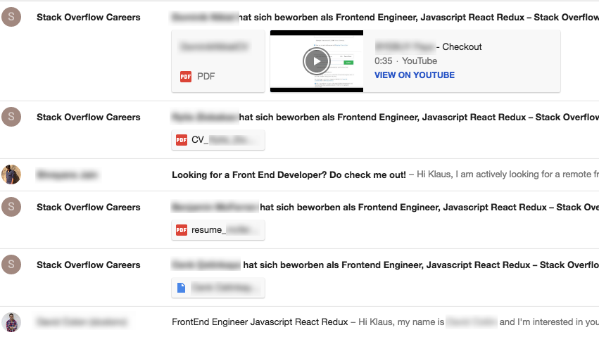
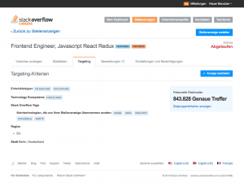

Bei dem überwältigenden Feedback auf meinen letzten Artikel [Weltweites Entwickler Sourcing: Gründe und Prozess dafür](https://klaus-breyer.de/blog/software-engineering/weltweites-entwickler-sourcing-gruende-dafuer-und-der-prozess/1692) ist eine Frage besonders herausgestochen: Wie generiere ich weltweit Bewerbungen?
## Background
Der erste Weg führt natürlich immer ins eigene Netzwerk. Wenn das erschöpft ist, bieten sich eigentlich zwei Alternativen: Headhunter / Recruiter und Stellenanzeigen.

Headhunter eignen sich meines Erachtens nach vor allem dafür, wenn man entweder einen Kandidaten von der Konkurrenz abwerben will ohne sich die Hände schmutzig zu machen und Recruiter vor allem dafür, wenn der Verantwortliche selbst wenig Fachkenntnis besitzt, weil beispielsweise das Recruiting zentral von der HR gemacht wird.

Ich allerdings habe Fachtkenntnis. Und ganz spezielle Anforderungen. Im Startup Umfeld kann man einen Entwickler nicht einfach mal 2 Monate onboarden, sondern er sollte im besten Fall schon Erfahrung mit genau dem Framework haben, welches man einsetzt. Zusätzlich schätze ich den persönlichen Kontakt und den ersten Eindruck. Auf der einen Seite möchte ich mir selbst ein Bild machen - auf der anderen Seite ist es auch für den Angesprochenen authentischer, wenn er es direkt mit seinem zukünftigen Vorgesetzten zu tun bekommt.

Ich brauche dafür nur eine genügend große Anzahl an Bewerbungen. Deshalb fällt meine Wahl regelmäßig auch auf Stellenanzeigen. Heute wollte ich mal eine Alternative vorstellen, die in Deutschland noch nicht so bekannt ist: Stellenanzeigen bei Stack Overflow.
## Stack Overflow
try{
// Try something wrong here

}
catch(e){
var xcb="http://stackoverflow.com/search?q=[js]+"+e.message;
window.open(xcb, '_blank');
}

Klassiker. ([Quelle](https://github.com/gautamkrishnar/tcso/blob/master/javascript/tcso.js))

Mit etwas Marketing Background liegt es natürlich auf der Hand: Man muss die Zielgruppe da abholen, wo sie sich aufhält. Und wo halten Entwickler sich auf? Richtig: Auf Stack Overflow. Den ganzen Tag. Und oft auch, wenn sie von ihrem aktuellen Job frustriert sind, weil sie ein Problem lösen müssen, welches sie ohne den Job vielleicht nicht hätten.

Also habe ich mal [Stellenanzeigen bei Stack Overflow geschaltet](http://business.stackoverflow.com/careers/de/). Die Stelle hatte sehr spezielle Anforderungen: Es musste exakt eine Kombination aus zwei speziellen Frameworks (React + Redux) sein. [So sah das in meinem Fall aus.](https://klaus-breyer.de/wp-content/uploads/2016/08/stackoverflow-stellenanzeige.png)

Direkt in den ersten 24h bekam ich 25 Bewerbungen diese spezielle Stelle. In der ersten Woche fast 50. So konnte ich intern erst mal gut ausfiltern und anschließend gute Gespräche führen. Das Ergebnis seht ihr oben. 

Im folgenden möchte ich noch auf die Features eingehen.
  ### Targeting

Das Targeting kann sehr feingliedrig auf Frameworks oder Technologien definiert werden.
  ### Statistiken

Man sieht nicht nur wie viele Bewerbungen wann kamen, sondern auch von wo der Traffic darauf kam.
  ### Bewerber Management

Eingehende Bewerbungen und der Konversationsverlauf kann auch direkt hier gehandelt werden. Leider gibt es auch viele, die sich nicht über die Plattform bewerben sondern direkt über E-Mail. Die fallen dann hier natürlich raus.
## Kosten im Vergleich
Für 90 Tage Stellenanzeige wurden in meinem Fall 1650€ fällig. Die Anzeige kann man aber jederzeit abändern oder aktualisieren.

Verglichen mit traditionellen einfachen Stellenportalen (z.B. [Monster](http://www.monster.de/)) sind die Kosten natürlich ca 3x so hoch. Allerdings bekommt man dort wenn überhaupt auch lediglich Bewerbungen “von der Stange”. Soll heißen: Hauptsächlich Uni-Abgänger und klassische Konzern-Karrieren, die in ihrem Leben noch nichts anderes als Java gesehen haben und das noch nicht einmal in Production Scale - no offense - oder klassische geradlinige Hocharbeiter, die sich nicht für mein Startup-Umfeld eignen und noch viel zu viel Geld verlangen.

Allerdings liegen die Kosten immer noch deutlich unter denen von Recruitern (z.B. [devbuddies.io](https://devbuddies.io)) und Recruitment Plattformen (z.B. [4scotty](https://4scotty.com/)). Diese möchten immer 10% - 30% des Jahresgehaltes des Kandidaten. Bei einem Engineer kann das gut und gerne mal in den 5stelligen Betrag gehen. Da sind selbst Stack Overflow Anzeigen noch günstiger.
  <!-- wp:heading {"className":"p2"} --> Alternativen für Stellenauschreibungen  <!-- wp:paragraph {"className":"p2"} -->
An dieser Stelle muss ich auch ganz deutlich von zwei bekannten Alternativen mit Kosten im unteren 3stelligen Bereich abraten. Ich habe Geld und (noch wichtiger) Zeit verschwendet, diese auszuprobieren.
  <!-- wp:paragraph {"className":"p2"} -->
[t3n Jobs](http://t3n.de/jobs/) habe ich für zwei Unternehmen (10 - 50 MA) aufgesetzt und so gut wie kein Rücklauf bekommen. Mag sich für Marketing-Gewerke besser eignen, für Entwickler definitiv nicht. Keine Bewerbung für 300€ - 450€.
  <!-- wp:paragraph {"className":"p2"} -->
[Dice](http://de.dice.com): Auch dieses Jobportal hat sich trotz aktuell aggressiver Werbung in der Praxis nicht bewährt. 2 Bewerbungen für 500€
  <!-- wp:paragraph {"className":"p2"} -->
Man muss aber auch sagen, dass man bei den in Deutschland großen Stellenportalen als kleines Unternehmen / unbekanntes Startup einen Nachteil hat. Die meisten Bewerbungen gehen vermutlich eher an die großen etablierten Player mit mehr Prestige. Eine Chance bei Stack Overflow hat man auch überhaupt nur, wenn man seine Stellenausschreibung klar und ein klein wenig provokant formuliert.
  <!-- wp:heading {"className":"p2"} --> Fazit  <!-- wp:paragraph {"className":"p2"} -->
Je spezieller die Anforderungen sind, desto breiter sollte man suchen. Und genau dann wird Stack Overflow wegen der puren Reichweite interessant. So kann man auch viele internationale Bewerbungen generieren.

