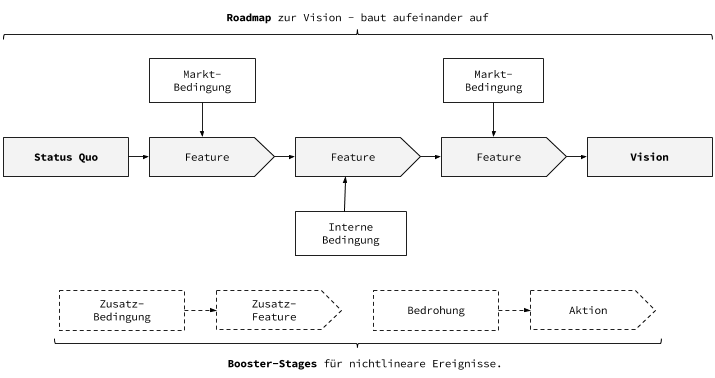

Wer mir heute einen perfekt durchdachten Plan zum erfolgreichen Unternehmen vorlegen würden, den würde ich auslachen. Es gibt in unserer komplexen Welt keinen fehlerfreien Plan zum Erfolg, da sich die externen Umstände ständig ändern. Der Erfolg eines Unternehmens ergibt sich dadurch, sowohl Anpassungsfähig zu sein als auch eine große Vision mitzubringen.
Roadmap
Die eigentliche Roadmap sollte vom heutigen Standpunkt [zur ganz großen Vision führen](https://klaus-breyer.de/blog/entrepreneurship/von-der-idee-zur-vision-der-eigene-handlungsspielraum-als-sliding-window/1808). Ohne Umwege. Die einzelnen Kern-Features sollten aufeinander aufbauen.

Bis gewisse Features ausgerollt werden können, müssen manchmal erst gewisse Bedingungen eintreten. Das können sowohl externe (z.B. gewisse Markt-Reife) als auch interne Faktoren (richtiges Personal, Datenbasis, etc. ) sein. An welchen Indikatoren das festgemacht wird, sollte als Bedingung notiert werden. Ansonsten wirkt die eigene Roadmap lediglich aus der Luft gegriffen.

Aus Gründen der Übersicht bilde ich externe und interne Bedingungen oberhalb und unterhalb der Roadmap ab.
Booster-Stages
Neben der produktiven Roadmap zur großen Vision gibt es in einem komplexen Markt natürlich immer noch Faktoren, die querschießen. Aber mit denen hat sich ein Unternehmer vermutlich schon beschäftigt und kann entsprechende Booster-Stages definieren, die im Fall der Fälle separat von der eigentlichen Roadmap gezündet werden können.

Das können sowohl konkrete und aufkommende Bedrohungen in der Marktdynamik sein, auf die man sich schon vorbereitet hat, oder auch geplante alternative Geschäfts- oder Abrechungs-Modelle, die an der eigentlichen Roadmap-Vision nichts ändern.

Die Booster-Stages können sowohl lediglich im Hinterkopf sein, als auch schon konkrete Pläne in der Schublade, die nur auf die Implementierung warten.
Lebendes Dokument
Es muss nicht immer alles seriell und voll geplant ablaufen. Wie schon geschrieben, gibt es nicht immer den perfekten Plan. Jede Roadmap muss regelmäßig justiert werden.

Ein solches Gerüst ist übrigens eine gute Basis für Gespräche mit Investoren. Es stellt die Tiefe der Vision mitsamt einem realistischen Plan dar. Gleichzeitig bieten einzelne Booster noch genügend Spielraum um Flexibilität gegenüber potentielle Bedrohungen und zusätzlichen Chancen aufzuzeigen.
